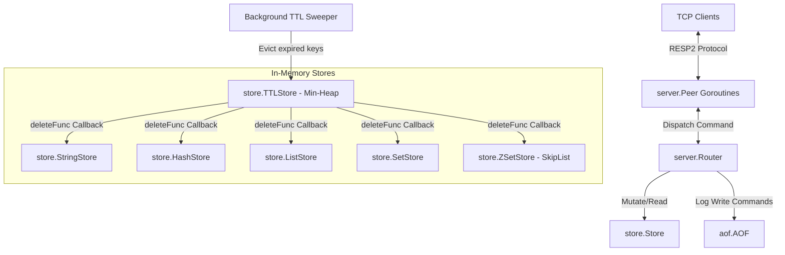

# Valkyr 🐺

Valkyr is a production-grade, highly concurrent Redis clone written in Go. It implements the **Redis Serialization Protocol (RESP2)** and supports key Redis features like Transactions, Pub/Sub, AOF persistence with background rewrite (compaction), Sorted Sets (ZSets), and memory limits with LRU/LFU eviction.

Unlike Redis's single-threaded event loop, Valkyr leverages Go's runtime scheduler and goroutines to handle networking and execution across multiple CPU cores, using fine-grained locks to control concurrent access.

---

## 🏛️ Architecture & Core Components



### 1. Concurrency Model
*   **Networking**: Spawns a dedicated goroutine for each client connection (`acceptLoop` inside [server.go](file:///Users/kartik/Projects/Valkyr/server/server.go)).
*   **Locking**: Uses fine-grained read-write locks (`sync.RWMutex`) at the store level (e.g. per hash key mapping, per set key mapping) to prevent global database contention while ensuring thread safety.

### 2. High-Performance Sorted Sets (ZSet)
*   Backing structure is a custom-implemented **Skip-List** with backward/forward pointers, levels, and spans, providing $O(\log N)$ average insertion, search, and deletion complexity.

### 3. Append-Only File (AOF) Compaction
*   **Buffered I/O**: Logs mutated operations to an AOF using a buffered `bufio.Writer`.
*   **Log Compaction (AOF Rewrite)**: Spawns a background goroutine to generate a point-in-time snapshot of the database state, while incoming write commands are logged into a temporary rewrite buffer. Once the snapshot is finished, the rewrite buffer is merged, and the main AOF file is replaced atomically.

### 4. Memory Limits & Eviction Engine
*   Tracks memory consumption and supports configurable memory limit flags (`maxmemory` and `maxmemory-policy`).
*   Implements **approximated LRU/LFU** eviction using key access metadata tracking, as well as Random eviction.

---

## 🚀 Features & Commands (80+)

Valkyr supports all 5 core Redis data structures and covers key operations:

*   **Connection**: `PING`, `ECHO`, `COMMAND`
*   **Strings**: `SET`, `GET`, `MSET`, `MGET`, `INCR`, `DECR`, `INCRBY`, `DECRBY`, `APPEND`, `STRLEN`, `GETSET`, `SETEX`, `PSETEX`, `SETRANGE`, `GETRANGE`, `MSETNX`
*   **Hashes**: `HSET`, `HGET`, `HGETALL`, `HDEL`, `HLEN`, `HKEYS`, `HEXISTS`, `HMSET`, `HMGET`, `HINCRBY`, `HINCRBYFLOAT`, `HVALS`, `HSCAN`, `HSTRLEN`
*   **Lists**: `LPUSH`, `RPUSH`, `LPOP`, `RPOP`, `LLEN`, `LRANGE`, `LINDEX`, `LSET`, `LREM`, `LTRIM`, `LINSERT`, `RPOPLPUSH`
*   **Sets**: `SADD`, `SREM`, `SMEMBERS`, `SISMEMBER`, `SCARD`, `SINTER`, `SUNION`, `SDIFF`, `SPOP`, `SRANDMEMBER`, `SMOVE`, `SSCAN`
*   **Sorted Sets (ZSets)**: `ZADD`, `ZRANGE`, `ZREM`, `ZCARD`, `ZSCORE`, `ZRANK`, `ZREVRANGE`, `ZREVRANK`, `ZCOUNT`
*   **Pub/Sub**: `SUBSCRIBE`, `UNSUBSCRIBE`, `PSUBSCRIBE`, `PUNSUBSCRIBE`, `PUBLISH`
*   **Transactions**: `MULTI`, `EXEC`, `DISCARD`
*   **Key/TTL/Utility**: `DEL`, `EXISTS`, `EXPIRE`, `EXPIREAT`, `TTL`, `PTTL`, `PEXPIRE`, `PEXPIREAT`, `PERSIST`, `TYPE`, `RENAME`, `KEYS`, `SCAN`, `UNLINK`, `TOUCH`, `DBSIZE`, `FLUSHDB`, `INFO`, `BGSAVE`, `BGREWRITEAOF`

---

## 🛠️ Getting Started

### Prerequisites
*   Go (version 1.18 or higher)

### Installation
Clone the repository and build the binary:
```bash
git clone https://github.com/kartik/valkyr.git
cd valkyr
go build -o valkyr main.go
```

### Running the Server
Run Valkyr on the default port `6379`:
```bash
./valkyr
```

Run with configuration overrides:
```bash
./valkyr --port 6380 --maxmemory 104857600 --maxmemory-policy allkeys-lru --loglevel debug
```

---

## 🧪 Testing and Benchmarks

### Running Tests
Execute all unit and integration tests:
```bash
go test -v ./...
```

### Running Benchmarks
Measure dispatch and store performance:
```bash
go test -bench=. ./server
```
